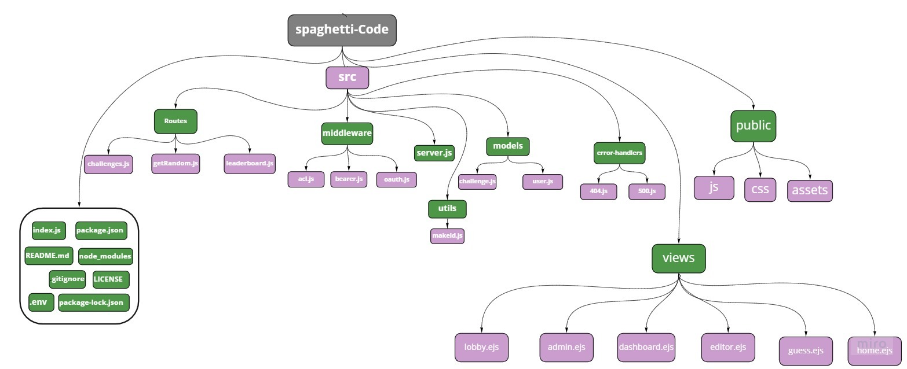
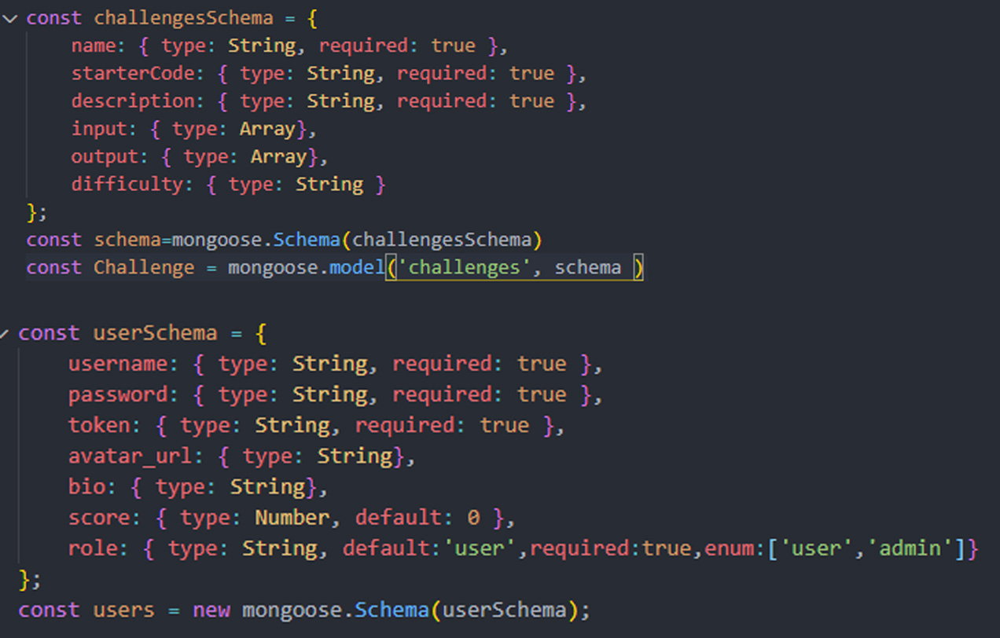
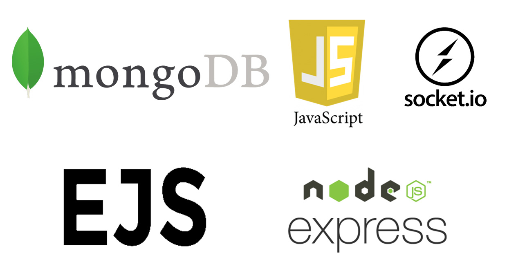

# spaghetti-code 🍝

- **Idea**: Private-sessioned code battles (with Video/Audio chat)
  - First player writes the code, second player guesses the output
  - Both players attempt to solve the challenge as quick as possible
  - Both players attempt to solve the challenge in smallest code size

---
  

---

File structure

---

MongoDB schemas

---
### Challenge Route

| Method | Endpoint | Description  |
| :---: | :--- | :--- |
| GET | /challenge | Gets all challenges in the DB. |
| GET | /challenge/:id | Gets one challenge from the DB by ID. |
| POST | /challenge | adds one challenge to the DB. |
| PUT | /challenge/:id| Edits one challenge from the DB. |
| DELET | /challenge/:id| Deletes one challenge from the DB. |

---

### User Route

| Method | Endpoint | Description  |
| :---: | :--- | :--- |
| GET | /User | Gets all Users in the DB. |
| GET | /User/:id | Gets one User from the DB by ID. |
| POST | /User | adds one User to the DB. |
| PUT | /User/:id| Edits one User from the DB. |
| DELET | /User/:id| Deletes one User from the DB. |

---

### Random Challenge Route

| Method | Endpoint | Description  |
| :---: | :--- | :--- |
| GET | /getrandom | Gets one challenge from the DB randomly. |

---

### User Route

| Method | Endpoint | Description  |
| :---: | :--- | :--- |
| GET | /leadreboard | Gets the top 10 users in the DB sorted by score. |

---

### Technology

---

## Deployed Link

https://spaghetti-code.herokuapp.com
